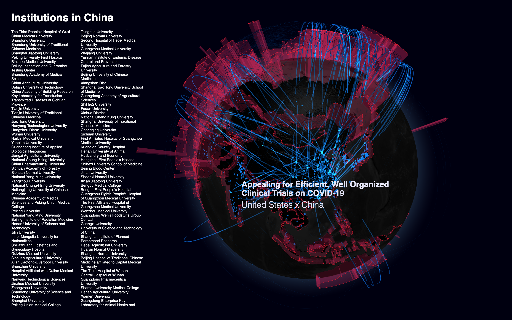

# Dis\[Re\]Connect

The source code is released as a part of a poster publication in VINCI 2020 conferences. 

Visit [Online](http://exhibition.wei.ski/dis-re-connect) (Google Chrome for the best performance).

Demo: [Video1](https://www.youtube.com/watch?v=Glei5vPQOwA),
[Video2](https://www.youtube.com/watch?v=gfUw4OkkDTE)

### Story 
This is a 3D interactive visualization showing the rising number of COVID-19 pandemic cases and comparing it with the collaborating global research efforts. The infection percentage of each country is shown as translucent crimson walls on its border, indicating a stronger tendency to level up border restrictions. Locations of institutions who have contributed to the pandemic research are indicated by light blue points on the earth. They are organically wired together by the peer-to-peer relationships nurtured by international co-authorships. Beneath each link is a published paper which marks a small step toward the final victory over the crisis. 

### Usage

In terminal, enter `npm install` then `npm run start` to run locally. Your broswer should start automatically. 

The default state slowly rotates the globe, showing all the connections of authors[1] throughout the world contributing to the fight against COVID-19. Mouse hovering on a link shows its paper title and collaborating countries. A country can be selected to view all the established works with authors from foreign institutes.

### Background
The visualization is motivated by the PhD research titled Pivotal Visualization: A Visualization Design Method to Enrich Exploration from Department of Industrial Design, TU/e. Under the theme of enriching exploration, it experiments the idea of improving exploration by experience through simple aesthetic expression of data and featherweight interactivity and analytics. We expect the potential of visual exploration in adding emotional value instead of rational knowledge following this principle is undervalued.

### Data Source
The raw data used in the visualization is aggregated from multiple sources, including the [official release from European Centre for Disease Prevention and Control (for distribution of case numbers)](https://www.ecdc.europa.eu/en/publications-data/download-todays-data-geographic-distribution-covid-19-cases-worldwide) and a processed version of the [Kaggle CORD-19 challenge data (for voluminous publication data that contributes to the COVID-19 situation)](https://www.kaggle.com/pgromano/cord19-paper-and-author-extract/metadata). The institution names are batch geocoded through Microsoft Bing's open API. Some incomplete data points are cleansed after the aggregation.

[1] *Disclaimer, the data is partially filtered. Some of the authors and papers may not be shown due to data quality and performance issues.
